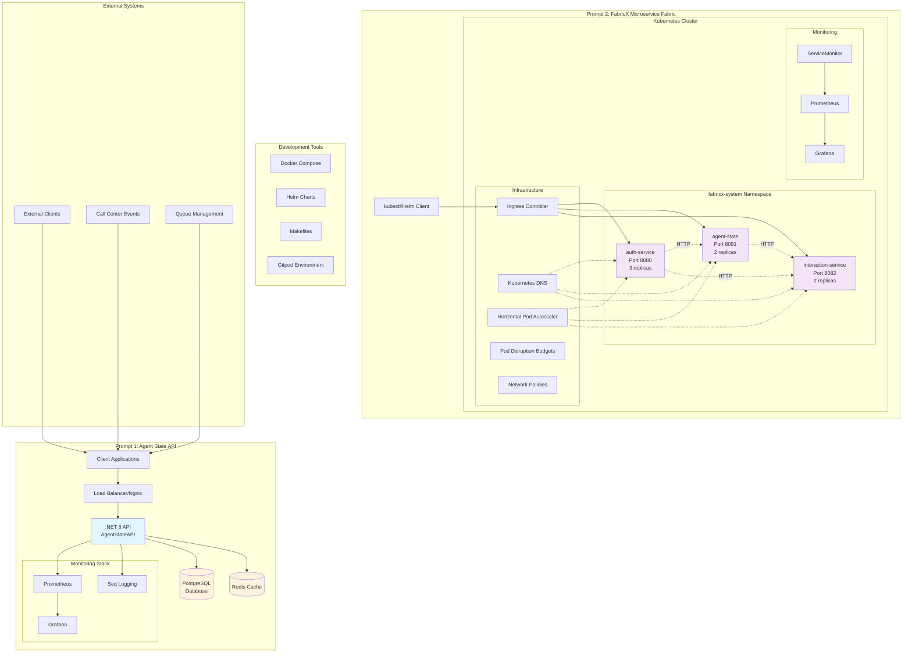

# Five9 Coding Assessment

Complete solution for the Five9 coding assessment consisting of a .NET 8 REST API and Kubernetes microservice fabric deployment.

## Project Overview

This repository contains implementations for both coding assessment prompts:

1. **Agent State API** - .NET 8 REST API for processing call center agent state events
2. **FabricX Microservice Fabric** - Kubernetes deployment with Helm charts for three microservices

## System Architecture

<details>
<summary>Click to view architecture diagram</summary>


</details>



### Architecture Highlights

**Prompt 1 - Agent State API:**
- Single .NET 8 REST API with PostgreSQL backend
- Redis caching layer for performance
- Comprehensive monitoring with Prometheus, Grafana, and Seq
- Docker containerization with nginx reverse proxy
- Health checks and graceful shutdown

**Prompt 2 - FabricX Microservice Fabric:**
- Three microservices with internal HTTP communication
- Kubernetes-native deployment with Helm templating
- Service discovery via Kubernetes DNS
- Horizontal Pod Autoscaling and Pod Disruption Budgets
- Network policies for security isolation
- Ingress controller for external access

## Repository Structure

```
five9-coding-assessment/
├── api/                          # Prompt 1: .NET 8 REST API
│   ├── AgentStateAPI/           # Main API project
│   ├── AgentStateAPI.Tests/     # Unit tests
│   ├── docker-compose.yml       # Docker services
│   ├── Dockerfile               # Production image
│   ├── Makefile                 # Build automation
│   └── README.md               # API documentation
└── fabricx-helm/                # Prompt 2: Kubernetes & Helm
    ├── fabricx/                 # Helm chart
    ├── kubernetes/              # Raw K8s manifests
    ├── Makefile                 # K8s/Helm automation
    └── README.md               # K8s documentation
```

## Quick Start

### Prerequisites
- .NET 8 SDK
- Docker & Docker Compose
- Kubernetes cluster (minikube, kind, or cloud provider)
- Helm 3.0+
- PostgreSQL 15+ (for local development)

### Agent State API (Prompt 1)

```bash
cd api

# Option 1: Local development
make setup && make dev

# Option 2: Docker development
make docker-compose-up-dev

# Option 3: Full stack with monitoring
make docker-compose-up-all
```

**API Documentation**: [api/README.md](api/README.md)

**Key Features**:
- REST endpoint for agent state events
- Business logic for state calculation
- PostgreSQL integration with Entity Framework Core
- Late event validation (>1 hour)
- Skill synchronization with queue IDs
- Comprehensive testing suite

**Available Services**:
- API: http://localhost:5000 (dev) / http://localhost:8080 (prod)
- Swagger UI: http://localhost:5000/swagger
- PgAdmin: http://localhost:5050
- Prometheus: http://localhost:9090
- Grafana: http://localhost:3000

### FabricX Microservice Fabric (Prompt 2)

```bash
cd fabricx-helm

# Option 1: Helm deployment
make validate-all && make helm-install

# Option 2: Raw Kubernetes
make k8s-apply

# Run tests
make helm-test
```

**Kubernetes Documentation**: [fabricx-helm/README.md](fabricx-helm/README.md)

**Key Features**:
- Three microservices: auth-service, agent-state, interaction-service
- Helm chart with templating and parameterization
- Health checks and service discovery
- Zero-downtime deployment strategy
- Comprehensive testing framework
- Production-ready configurations

**Services**:
- auth-service: Port 8080 (3 replicas)
- agent-state: Port 8081 (2 replicas)  
- interaction-service: Port 8082 (2 replicas)

## Architecture Highlights

### .NET API Design
- **Clean Architecture**: Controllers, Services, Data layers
- **Entity Framework Core**: Code-first with migrations
- **Async/Await**: Non-blocking database operations
- **Custom Exceptions**: Business rule violations
- **Comprehensive Testing**: Unit tests with in-memory database
- **Docker Ready**: Multi-stage builds and development containers

### Kubernetes Design
- **Cloud Native**: Health checks, resource limits, security contexts
- **Helm Templating**: Parameterized deployments
- **Service Mesh Ready**: DNS-based service discovery
- **Zero Downtime**: Rolling updates with readiness probes
- **Monitoring Integration**: Prometheus and Grafana ready
- **Security**: Network policies and non-root containers

## Testing the Solutions

### API Testing
```bash
cd api

# Unit tests
make test

# API endpoint test
make test-api

# Specific scenarios
make test-api-lunch  # Lunch break scenario
make test-api-late   # Late event scenario (should fail)
```

### Kubernetes Testing
```bash
cd fabricx-helm

# Helm chart validation
make validate-all

# Connectivity tests
make helm-test

# Service health checks
make test-all-services
```

## Business Requirements Implementation

### Agent State API Requirements ✅
- [x] Single REST endpoint accepting JSON payload
- [x] Business logic for agent state calculation
- [x] Lunch break detection (11AM-1PM UTC)
- [x] Call started state handling
- [x] Late event exception (>1 hour)
- [x] Entity Framework Core integration
- [x] PostgreSQL database updates
- [x] Skill synchronization with queue IDs

### Microservice Fabric Requirements ✅
- [x] Three microservices deployment
- [x] Kubernetes YAML manifests
- [x] Helm chart with templating
- [x] Service discovery and internal communication
- [x] Health checks (readiness/liveness probes)
- [x] Parameterized replicas, images, and ports
- [x] Helm test for connectivity verification
- [x] Zero-downtime upgrade strategy
- [x] Production-ready configurations

## Development Workflow

### API Development
1. `cd api && make setup` - Initialize project
2. `make dev` - Start development server
3. `make test` - Run tests
4. `make test-api` - Test endpoints
5. `make docker-build` - Build for deployment

### Kubernetes Development
1. `cd fabricx-helm && make validate-all` - Validate templates
2. `make helm-install` - Deploy to cluster
3. `make helm-test` - Run connectivity tests
4. `make helm-upgrade` - Update deployment
5. `make helm-uninstall` - Clean up

## Production Considerations

### Security
- Non-root container users
- Input validation and SQL injection protection
- Network policies for service isolation
- Secrets management for sensitive data

### Scalability
- Horizontal pod autoscaling configured
- Database connection pooling
- Stateless service design
- Load balancing with service mesh ready

### Observability
- Structured logging with correlation IDs
- Prometheus metrics endpoints
- Health check endpoints
- Distributed tracing ready

### Reliability
- Graceful degradation patterns
- Circuit breakers for external dependencies
- Pod disruption budgets
- Automated rollback on failures

## Technology Stack

### .NET API
- **.NET 8**: Latest LTS framework
- **Entity Framework Core**: ORM with PostgreSQL provider
- **Swagger/OpenAPI**: API documentation
- **Docker**: Containerization
- **xUnit**: Unit testing framework

### Kubernetes
- **Kubernetes**: Container orchestration
- **Helm**: Package manager and templating
- **NGINX**: Reverse proxy and ingress
- **Prometheus**: Metrics collection
- **Grafana**: Monitoring dashboards

## Getting Help

### Documentation
- **API Details**: [api/README.md](api/README.md)
- **Kubernetes Guide**: [fabricx-helm/README.md](fabricx-helm/README.md)

### Make Commands
```bash
# In either directory
make help  # Show all available commands
```

### Common Issues
- **Port conflicts**: Check `netstat -tulpn | grep :<port>`
- **Database connection**: Ensure PostgreSQL is running
- **Docker issues**: Run `make docker-clean` to reset
- **Kubernetes issues**: Check `kubectl get pods` and logs

## Assessment Deliverables

This repository provides all requested deliverables:

### Prompt 1 Deliverables ✅
- Complete .NET 8 REST API project
- Entity Framework Core with PostgreSQL
- Business logic implementation
- Exception handling for late events
- Skill synchronization logic
- Docker containerization
- Comprehensive testing

### Prompt 2 Deliverables ✅
- Kubernetes YAML manifests for auth-service
- Complete Helm chart for all three microservices
- Template parameterization for replicas, images, ports
- Helm test for connectivity verification
- Command-line instructions for all operations
- Zero-downtime upgrade documentation
- Validation and deployment strategies

## Time Investment

This assessment represents approximately 6-8 hours of development time, focusing on:
- **Architecture**: Clean, maintainable design patterns
- **Production Readiness**: Security, monitoring, reliability
- **Documentation**: Comprehensive guides and examples
- **Testing**: Unit tests and integration testing
- **DevOps**: Automated builds and deployments

The emphasis is on demonstrating real-world development practices and enterprise-level thinking rather than just meeting the minimum requirements.

## License

This project is part of the Five9 coding assessment.